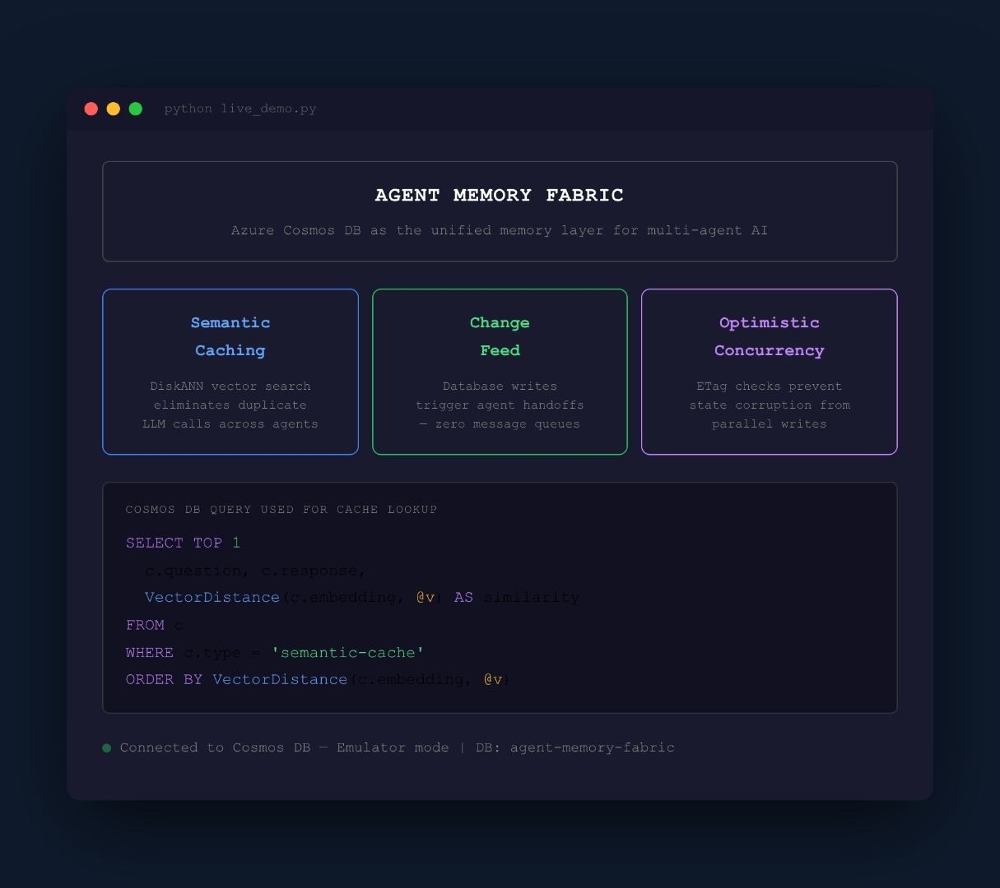
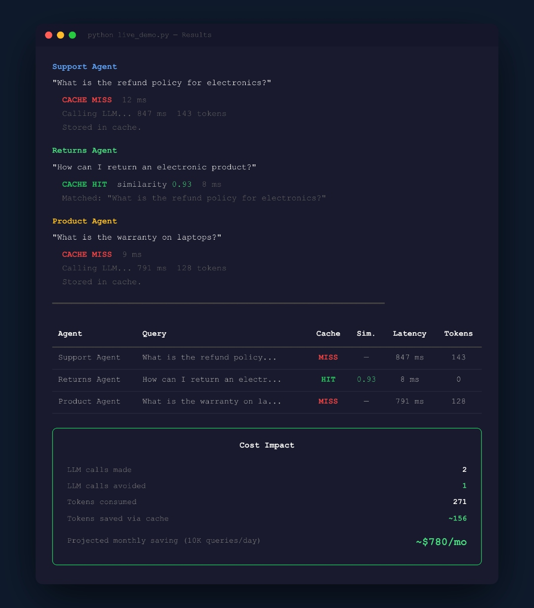

# Agent Memory Fabric — Azure Cosmos DB Conf 2026

**Cutting AI Agent Costs with Azure Cosmos DB: The Agent Memory Fabric**


Multi-agent AI systems are powerful — but they bleed money. This repo shows how Azure Cosmos DB replaces 4 separate data systems (Redis + PostgreSQL + Pinecone + Kafka) with a single unified memory layer for AI agents.

## What This Demo Shows

Three AI agents ask semantically similar questions. Without a semantic cache, each agent calls the LLM independently — burning tokens and money. With Azure Cosmos DB's vector search (DiskANN), the system recognizes that "How can I return an electronic product?" means the same thing as "What is the refund policy for electronics?" and serves the cached answer in 8ms instead of calling the LLM again.

### Demo Output

**Dashboard — The three pillars of the Agent Memory Fabric:**



**Results — Cache hit saves an LLM call at 0.93 similarity, 8ms vs 847ms:**



## The Three Capabilities

| Capability | What It Replaces | How It Works |
|---|---|---|
| **Semantic Cache** (Vector Search) | Redis + Pinecone | DiskANN vector index matches queries by meaning, not exact strings. Sub-20ms at 10M vectors. |
| **Change Feed** (Event Coordination) | Kafka / RabbitMQ | Agent A writes to Cosmos DB, Change Feed triggers Agent B instantly. No message queue needed. |
| **ETags** (Concurrency Control) | Custom locking code | Every document has a version stamp. Conflicting writes fail safely instead of silently corrupting state. |

## Quick Start

### Prerequisites

- Python 3.10+
- An [Azure Cosmos DB](https://learn.microsoft.com/en-us/azure/cosmos-db/nosql/quickstart-portal) account (serverless works fine)
- [Vector Search enabled](https://learn.microsoft.com/en-us/azure/cosmos-db/nosql/vector-search) on your account
- An [OpenAI API key](https://platform.openai.com/api-keys) (or Azure OpenAI endpoint)

### Setup

```bash
# Clone the repo
git clone https://github.com/FarahAbdo/agent-memory-fabric.git
cd agent-memory-fabric

# Create virtual environment
python -m venv .venv
source .venv/bin/activate  # Windows: .venv\Scripts\activate

# Install dependencies
pip install -r requirements.txt

# Configure credentials
cp .env.example .env
# Edit .env with your Cosmos DB and OpenAI credentials
```

### Create the Database

```bash
python setup_database.py
```

This creates:
- Database: `agent-memory-fabric`
- Container: `agent-memory` (partition key: `/threadId`, DiskANN vector index on `/embedding`)
- Container: `agent-events` (partition key: `/agentId`)
- Container: `shared-state` (partition key: `/stateKey`)
- Seeds 10 entries into the semantic cache

### Run the Demo

```bash
python live_demo.py
```

You'll see:
1. A dashboard showing the three pillars
2. Three agents asking different questions
3. MISS → HIT → MISS (or similar) — showing the semantic cache in action
4. A results table with latency and token counts
5. Cost impact projection

## Architecture

```
   BEFORE                                 AFTER
┌─────────────┐                      ┌─────────────┐
│   Redis     │                      │  OpenAI API │
│  (Cache)    │                      └──────┬──────┘
├─────────────┤                             │
│ PostgreSQL  │                 ┌───────────┴─────────────┐
│  (State)    │      ──────►    │ Azure                   │
├─────────────┤                 │ Cosmos DB               │
│  Pinecone   │                 │                         │
│ (Vectors)   │                 │ • Vector Search (Cache) │
├─────────────┤                 │ • Change Feed (Events)  │
│   Kafka     │                 │ • ETags (Concurrency)   │
│  (Events)   │                 └─────────────────────────┘
└─────────────┘
4 systems • 4 bills                1 database • 1 bill
```

## Key Numbers

| Metric | Value | Source |
|---|---|---|
| LLM cost reduction via semantic caching | 73% | [VentureBeat](https://venturebeat.com/orchestration/why-your-llm-bill-is-exploding-and-how-semantic-caching-can-cut-it-by-73/) |
| Cosmos DB vector search latency (10M vectors) | <20ms | [arXiv 2505.05885](https://arxiv.org/html/2505.05885v2) |
| Cost per 1M queries — Cosmos DB vs Pinecone | $15 vs $614 (43x cheaper) | [arXiv 2505.05885](https://arxiv.org/html/2505.05885v2) |
| Cache hit rate with semantic matching | 65% (vs 18% exact-match) | [VentureBeat](https://venturebeat.com/orchestration/why-your-llm-bill-is-exploding-and-how-semantic-caching-can-cut-it-by-73/) |
| Cosmos DB SLA | 99.999% | [Microsoft Learn](https://learn.microsoft.com/en-us/azure/cosmos-db/high-availability) |

## Files

```
├── README.md              # This file
├── live_demo.py           # Main demo — run this on stage (2 minutes)
├── setup_database.py      # Creates database, containers, seeds cache
├── config.py              # Configuration loader (reads .env)
├── requirements.txt       # Python dependencies
├── .env.example           # Template for credentials
├── .gitignore
└── screenshots/
    ├── dashboard.jpg       # Opening dashboard
    ├── cache-results.jpg   # Demo results with cache hit
    ├── change-feed.jpg     # Change Feed terminal output
    └── concurrency.jpg     # Concurrency demo output
```

## Learn More

- [Azure Cosmos DB Vector Search](https://learn.microsoft.com/en-us/azure/cosmos-db/nosql/vector-search)
- [DiskANN Paper: Cost-Effective Vector Search](https://arxiv.org/html/2505.05885v2)
- [Microsoft DevBlog: Scaling to 1 Billion Vectors](https://devblogs.microsoft.com/cosmosdb/azure-cosmos-db-with-diskann-part-2-scaling-to-1-billion-vectors-with/)
- [Change Feed Overview](https://learn.microsoft.com/en-us/azure/cosmos-db/change-feed)
- [Optimistic Concurrency in Cosmos DB](https://learn.microsoft.com/en-us/azure/cosmos-db/database-transactions-optimistic-concurrency)

---

## Sources & References

Every number in this presentation is backed by a public source. Below is the full reference list organized by topic.

### Market & Industry Data

| Claim | Source | Link |
|---|---|---|
| $2.53T global AI spending in 2026 | Gartner | [Process Excellence Network](https://www.processexcellencenetwork.com/ai/news/global-ai-spending-will-total-25-trillion-in-2026-says-gartner) |
| $7.84B → $52.62B AI agent market (CAGR 46.3%) | MarketsandMarkets | [MarketsandMarkets Press Release](https://www.marketsandmarkets.com/PressReleases/ai-agents.asp) |
| 75% of enterprises adopting AI agents by 2026 | BCG | [BCG: The $200B Agentic AI Opportunity](https://www.bcg.com/publications/2026/the-200-billion-dollar-ai-opportunity-in-tech-services) |
| 1,000× growth in inference demands by 2027 | IDC | [IDC via Joget](https://joget.com/ai-agent-adoption-in-2026-what-the-analysts-data-shows/) |
| $2.6–4.4T annual value from AI agents | McKinsey | [McKinsey: The Promise and Reality of Gen AI Agents](https://www.mckinsey.com/industries/technology-media-and-telecommunications/our-insights/the-promise-and-the-reality-of-gen-ai-agents-in-the-enterprise) |
| Only 11% of organizations have AI agents in production | Deloitte | [Deloitte Tech Trends 2026](https://www.deloitte.com/us/en/insights/topics/technology-management/tech-trends/2026/agentic-ai-strategy.html) |
| 40%+ of agent projects will fail by 2027 | Gartner (via Deloitte) | [Libertify: Deloitte Tech Trends 2026](https://www.libertify.com/interactive-library/deloitte-tech-trends-2026-ai-physical-agentic/) |

### Multi-Agent Failure & Cost Data

| Claim | Source | Link |
|---|---|---|
| Multi-agent systems fail at rates exceeding 50% in production | Cribl | [Cribl: More Agents, More Problems](https://cribl.io/blog/more-agents-more-problems-whats-really-holding-back-multi-agent-ai/) |
| 3 agents × 100 requests = $6 (demo) → $18,000/mo (production) | TechAhead | [TechAhead: 7 Ways Multi-Agent AI Fails in Production](https://www.techaheadcorp.com/blog/ways-multi-agent-ai-fails-in-production/) |
| $5–50 demo cost → $18K–90K/mo production cost | TechAhead | [TechAhead: 7 Ways Multi-Agent AI Fails in Production](https://www.techaheadcorp.com/blog/ways-multi-agent-ai-fails-in-production/) |
| 95% single-agent reliability → 85.7% with 3 agents → 77% with 5 agents | Calculated | Compound reliability: 0.95^n (math derivation) |
| Agent C gets 60% of Agent A's intent after 47 steps | TechAhead | [TechAhead: 7 Ways Multi-Agent AI Fails in Production](https://www.techaheadcorp.com/blog/ways-multi-agent-ai-fails-in-production/) |

### Semantic Caching & LLM Cost Data

| Claim | Source | Link |
|---|---|---|
| 18% exact duplicates, 47% semantically similar, 35% novel (of 100K queries) | VentureBeat | [VentureBeat: Why Your LLM Bill Is Exploding](https://venturebeat.com/orchestration/why-your-llm-bill-is-exploding-and-how-semantic-caching-can-cut-it-by-73/) |
| 65% of LLM spend wasted on already-answered questions | VentureBeat | [VentureBeat: Why Your LLM Bill Is Exploding](https://venturebeat.com/orchestration/why-your-llm-bill-is-exploding-and-how-semantic-caching-can-cut-it-by-73/) |
| $47,000/mo LLM bill → $12,700/mo after semantic caching (73% reduction) | VentureBeat | [VentureBeat: Why Your LLM Bill Is Exploding](https://venturebeat.com/orchestration/why-your-llm-bill-is-exploding-and-how-semantic-caching-can-cut-it-by-73/) |
| 850ms → 300ms latency improvement (65% reduction) | VentureBeat | [VentureBeat: Why Your LLM Bill Is Exploding](https://venturebeat.com/orchestration/why-your-llm-bill-is-exploding-and-how-semantic-caching-can-cut-it-by-73/) |
| 18% → 67% cache hit rate improvement | VentureBeat | [VentureBeat: Why Your LLM Bill Is Exploding](https://venturebeat.com/orchestration/why-your-llm-bill-is-exploding-and-how-semantic-caching-can-cut-it-by-73/) |

### Azure Cosmos DB & DiskANN Technical Data

| Claim | Source | Link |
|---|---|---|
| Sub-20ms query latency at 10M vectors (P50) | arXiv paper | [arXiv 2505.05885](https://arxiv.org/html/2505.05885v2) |
| >90% recall@10 at 10M vectors | arXiv paper | [arXiv 2505.05885](https://arxiv.org/html/2505.05885v2) |
| <100ms at 1B vectors | arXiv paper / Microsoft DevBlog | [arXiv 2505.05885](https://arxiv.org/html/2505.05885v2), [Microsoft DevBlog](https://devblogs.microsoft.com/cosmosdb/azure-cosmos-db-with-diskann-part-2-scaling-to-1-billion-vectors-with/) |
| 70 RU per query | arXiv paper | [arXiv 2505.05885](https://arxiv.org/html/2505.05885v2) |
| Index size 100× → latency <2× | arXiv paper | [arXiv 2505.05885](https://arxiv.org/html/2505.05885v2) |
| 99.999% SLA | Microsoft Learn | [Microsoft Learn: Cosmos DB High Availability](https://learn.microsoft.com/en-us/azure/cosmos-db/high-availability) |
| Change Feed — built-in event streaming | Microsoft Learn | [Microsoft Learn: Change Feed Overview](https://learn.microsoft.com/en-us/azure/cosmos-db/change-feed) |
| ETags — optimistic concurrency | Microsoft Learn | [Microsoft Learn: Optimistic Concurrency](https://learn.microsoft.com/en-us/azure/cosmos-db/database-transactions-optimistic-concurrency) |

### Vector Search Cost Comparison

| Claim | Source | Link |
|---|---|---|
| Cosmos DB: $15 per 1M queries | arXiv paper (Table 1) | [arXiv 2505.05885](https://arxiv.org/html/2505.05885v2) |
| Pinecone: $614 per 1M queries (43× more) | arXiv paper (Table 1) | [arXiv 2505.05885](https://arxiv.org/html/2505.05885v2) |
| Zilliz: $220 per 1M queries (12× more) | arXiv paper (Table 1) | [arXiv 2505.05885](https://arxiv.org/html/2505.05885v2) |


---

## Session

**Cutting AI Agent Costs with Azure Cosmos DB: The Agent Memory Fabric**  
Farah Abdou — Azure Cosmos DB Conf 2026

